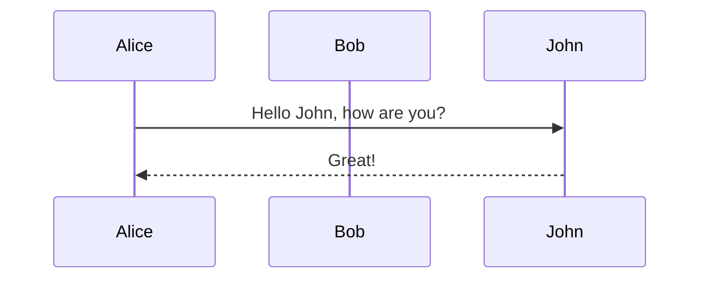

# Tal Perry Blog

Personal Hugo site with a refreshed layout focused on readable typography and simple navigation.

## Features
- Card-based home/archive with featured images, tags, dates, and reading time
- Sticky header with navigation (Home, Archive, About, Contact) and footer with RSS/email
- Article view with optional table of contents, hero image, and prev/next links
- Modern serif/sans pairing (Playfair Display + DM Sans) with constrained reading width and generous spacing
- Mermaid diagram support via render hook and on-demand script loading
- Letter art stored in `assets/letters` as WebP (tracked with Git LFS); shortcodes resize to multiple sizes at build time

## Mermaid diagrams
Use fenced code blocks with the `mermaid` language. The render hook sets a flag to load Mermaid only on pages that include diagrams.

## Development
- Build: `make build`
- Live preview: `make serve` (runs `hugo server -D --disableFastRender --gc`)
- Clean generated assets: `make clean`
- Large assets: install Git LFS (`git lfs install`) and ensure `git lfs pull` before building so letter images are available to Hugo pipelines
- If you already cloned before Git LFS was added, run `git lfs install` and `git add --renormalize assets/letters/*.webp && git commit` to store those files as LFS pointers
