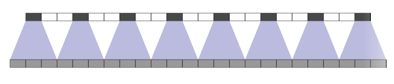

### tl;dr

* RNNS work great for text but convolutions can do it faster
* Any part of a sentence can influence the semantics of a word. For that reason we want our network to see the entire input at once
* Getting that big a receptive can make gradients vanish and our networks fail
* We can solve the vanishing gradient problem with DenseNets or Dilated Convolutions
* Sometimes we need to generate text. We can use “deconvolutions” to generate arbitrarily long outputs.

### Intro

Over the last three years, the field of NLP has gone through a huge revolution thanks to deep learning. The leader of this revolution has been the recurrent neural network and particularly its manifestation as an LSTM. Concurrently the field of computer vision has been reshaped by convolutional neural networks. This post explores what we “text people” can learn from our friends who are doing vision.

### Common NLP Tasks

To set the stage and agree on a vocabulary, I’d like to introduce a few of the more common tasks in NLP. For the sake of consistency, I’ll assume that all of our model’s inputs are characters and that our “unit of observation” is a sentence. Both of these assumptions are just for the sake of convenience and you can replace characters with words and sentences with documents if you so wish.

#### Classification

Perhaps the oldest trick in the book, we often want to classify a sentence. For example, we might want to classify an email subject as indicative of spam, guess the sentiment of a product review or assign a topic to a document.

The straightforward way to handle this kind of task with an RNN is to feed entire sentence into it, character by character, and then observe the RNNs final hidden state.

#### Sequence Labeling

Sequence labeling tasks are tasks that return an output for each input. Examples include part of speech labeling or entity recognition tasks. While the bare bones LSTM model is far from the state of the art, it is easy to implement and offers compelling results. See [this paper](https://arxiv.org/pdf/1508.01991.pdf) for a more fleshed out architecture

#### Sequence Generation

Arguably the most impressive results in recent NLP have been in translation. Translation is a mapping of one sequence to another, with no guarantees on the length of the output sentence. For example, translating the first words of the Bible from Hebrew to English is בראשית = “In the Beginning”.

At the core of this success is the Sequence to Sequence (AKA encoder decoder) framework, a methodology to “compress” a sequence into a code and then decode it to another sequence. Notable examples include translation (Encode Hebrew and decode to English), image captioning (Encode an Image and decode a textual description of its contents)

The basic Encoder step is similar to the scheme we described for classification. What’s amazing is that we can build a decoder that learns to generate arbitrary length outputs.

The two examples above are really both translation, but sequence generation is a bit broader than that. OpenAI recently [published a paper](https://blog.openai.com/unsupervised-sentiment-neuron/) where they learn to generate “Amazon Reviews” while controlling the sentiment of the output

Another personal favorite is the paper [Generating Sentences from a Continuous Space](https://arxiv.org/pdf/1511.06349.pdf). In that paper, they trained a variational autoencoder on text, which led to the ability to interpolate between two sentences and get coherent results.

### Requirements from an NLP architecture

What all of the implementations we looked at have in common is that they use a recurrent architecture, usually an LSTM (If your not sure what that is, [here](http://karpathy.github.io/2015/05/21/rnn-effectiveness/) is a great intro) . It is worth noting that none of the tasks had recurrent in their name, and none mentioned LSTMs. With that in mind, lets take a moment to think what RNNs and particularly LSTMs provide that make them so ubiquitous in NLP.

#### Arbitrary Input Size

A standard feed forward neural network has a parameter for every input. This becomes problematic when dealing with text or images for a few reasons.

1. It restricts the input size we can handle. Our network will have a finite number of input nodes and won’t be able to grow to more.
2. We lose a lot of common information. Consider the sentences “I like to drink beer a lot” and “I like to drink a lot of beer”. A feed forward network would have to learn about the concept of “a lot” twice as it appears in different input nodes each time.

Recurrent neural networks solve this problem. Instead of having a node for each input, we have a big “box” of nodes that we apply to the input again and again. The “box” learns a sort of transition function, which means that the outputs follow some recurrence relation, hence the name.

Remember that the _vision people_ got a lot of the same effect for images using convolutions. That is, instead of having an input node for each pixel, convolutions allowed the reuse of the same, small set of parameters across the entire image.

#### Long Term Dependencies

The promise of RNNs is their ability to implicitly model long term dependencies. The picture below is taken from OpenAI. They trained a model that ended up recognizing sentiment and colored the text, character by character, with the model’s output. Notice how the model sees the word “best” and triggers a positive sentiment which it carries on for over 100 characters. That’s capturing a long range dependency.

The theory of RNNs promises us long range dependencies out of the box. The practice is a little more difficult. When we learn via backpropagation, we need to propagate the signal through the entire recurrence relation. The thing is, at every step we end up multiplying by a number. If those numbers are generally smaller than 1, our signal will quickly go to 0. If they are larger than 1, then our signal will explode.

These issues are called the vanishing and exploding gradient and are generally resolved by LSTMs and a few clever tricks. I mention them know because we’ll encounter these problems again with convolutions and will need another way to address them.

### Advantages of convolutions

So far we’ve seen how great LSTMs are, but this post is about convolutions. In the spirit of _don’t fix what ain’t broken_, we have to ask ourselves why we’d want to use convolutions at all.

One answer is “ Because we can”.

But there are two other compelling reasons to use convolutions, speed, and context.

#### Parrelalisation

RNNs operate sequentially, the output for the second input depends on the first one and so we can’t parallelise an RNN. Convolutions have no such problem, each “patch” a convolutional kernel operates on is independent of the other meaning that we can go over the entire input layer concurrently.

There is a price to pay for this, as we’ll see we have to stack convolutions into deep layers in order to view the entire input and each of those layers is calculated sequentially. But the calculations at each layer happen concurrently and each individual computation is small (compared to an LSTM) such that in practice we get a big speed up.

When I set out to write this I only had my own experience and Google’s ByteNet to back this claim up. Just this week, Facebook published their fully convolutional translation model and reported a 9X speed up over LSTM based models.

#### View the whole input at once

LSTMs read their input from left to right (or right to left) but sometimes we’d like to have the context of the end of the sentence influence the networks thoughts about its begining. For example, we might have a sentence like “I’d love to buy your product. Not!” and we’d like that negation at the end to influence the entire sentence.

With LSTMs we achieve this by running two LSTMs, one left to right and the other right to left and concatenating their outputs. This works well in practice but doubles our computational load.

Convolutions, on the other hand, grow a larger “receptive field” as we stack more and more layers. That means that by default, each “step” in the convolution’s representation views all of the input in its receptive field, from before and after it. I’m not aware of any definitive argument that this is inherently better than an LSTM, but it does give us the desired effect in a controllable fashion and with a low computational cost.

So far we’ve set up our problem domain and talked a bit about the conceptual advantages of convolutions for NLP. From here out, I’d like to translate those concepts into practical methods that we can use to analyze and construct our networks.

### Practical convolutions for text

You’ve probably seen an animation like the one above illustrating what a convolution does. The bottom is an input image, the top is the result and the gray shadow is the convolutional kernel which is repeatedly applied.

This all makes perfect sense except that the input described in the picture is an image, with two spatial dimensions (height and width). We’re talking about text, which has only one dimension, and it’s temporal not spatial.

For all practical purposes, that doesn’t matter. We just need to think of our text as an image of width _n_ and height 1. Tensorflow provides a conv1d function that does that for us, but it does not expose other convolutional operations in their 1d version.

To make the “Text = an image of height 1” idea concrete, let’s see how we’d use the 2d convolutional op in Tensorflow on a sequence of embedded tokens.

So what we’re doing here is changing the shape of input with tf.expand\_dims so that it becomes an “Image of height 1”. After running the 2d convolution operator we squeeze away the extra dimension.

### Hierarchy and Receptive Fields

Many of us have seen pictures like the one above. It roughly shows the hierarchy of abstractions a CNN learns on images. In the first layer, the network learns basic edges. In the next layer, it combines those edges to learn more abstract concepts like eyes and noses. Finally, it combines those to recognize individual faces.

With that in mind, we need to remember that each layer doesn’t just learn more abstract combinations of the previous layer. Successive layers, implicitly or explicitly, see more of the input

#### Increasing Receptive Field

With vision often we’ll want the network to identify one or more objects in the picture while ignoring others. That is, we’ll be interested in some local phenomenon but not in a relationship that spans the entire input.

Text is more subtle as often we’ll want intermediate representations of our data to carry as much context about their surroundings as they possibly can. In other words, we want to have as large a receptive field as possible. Their are a few ways to go about this.

#### Larger Filters

The first, most obvious, way is to increase the filter size, that is doing a \[1x5\] convolution instead of a \[1x3\]. In my work with text, I’ve not had great results with this and I’ll offer my speculations as to why.

In my domain, I mostly deal with character level inputs and with texts that are morphologicaly very rich. I think of (at least the first) layers of convolution as learning n-grams so that the width of the filter corresponds to bigrams, trigrams etc. Having the network learn larger n-grams early exposes it to fewer examples, as there are more occurrences of “ab” in a text than “abb”.

I’ve never proved this interpretation but have gotten consistently poorer results with filter widths larger than 3.

#### Adding Layers

As we saw in the picture above, adding more layers will increase the receptive field. [Dang Ha The Hien](https://medium.com/u/b04dc6044cc) wrote a [great guide](https://medium.com/@nikasa1889/a-guide-to-receptive-field-arithmetic-for-convolutional-neural-networks-e0f514068807) to calculating the receptive field at each layer which I encourage you to read.

Adding layers has two distinct but related effects. The one that gets thrown around a lot is that the model will learn to make higher level abstractions over the inputs that it gets (Pixels =>Edges => Eyes => Face). The other is that the receptive field grows at each step .

This means that given enough depth, our network could look at the entire input layer though perhaps through a haze of abstractions. Unfortunately this is where the vanishing gradient problem may rear its ugly head.

#### The Gradient / Receptive field trade off

Neural networks are networks that information flows through. In the forward pass our input flows and transforms, hopefully becoming a representation that is more amenable to our task. During the back phase we propagate a signal, the gradient, back through the network. Just like in vanilla RNNs, that signal gets multiplied frequently and if it goes through a series of numbers that are smaller than 1 then it will fade to 0. That means that our network will end up with very little signal to learn from.

This leaves us with something of a tradeoff. On the one hand, we’d like to be able to take in as much context as possible. On the other hand, if we try to increase our receptive fields by stacking layers we risk vanishing gradients and a failure to learn anything.

### Two Solutions to the Vanishing Gradient Problem

Luckily, many smart people have been thinking about these problems. Luckier still, these aren’t problems that are unique to text, the _vision people_ also want larger receptive fields and information rich gradients. Let’s take a look at some of their crazy ideas and use them to further our own textual glory.

#### Residual Connections

2016 was another great year for the _vision people_ with at least two very popular architectures emerging, [ResNets](https://arxiv.org/abs/1512.03385) and [DenseNets](https://arxiv.org/abs/1608.06993) (The DenseNet paper, in particular, is exceptionally well written and well worth the read) . Both of them address the same problem “How do I make my network very deep without losing the gradient signal?”

[Arthur Juliani](https://medium.com/u/18dfe63fa7f0) wrote a fantastic overview of [Resnet, DenseNets and Highway networks](https://chatbotslife.com/resnets-highwaynets-and-densenets-oh-my-9bb15918ee32) for those of you looking for the details and comparison. I’ll briefly touch on DenseNets which take the core concept to its extreme.

The general idea is to reduce the distance between the signal coming from the networks loss and each individual layer. The way this is done is by adding a residual/direct connection between every layer and its predecessors. That way, the gradient can flow from each layer to its predecessors directly.

DenseNets do this in a particularly interesting way. They concatenate the output of each layer to its input such that:

1. We start with an embedding of our inputs, say of dimension 10.
2. Our first layer calculates 10 feature maps. It outputs the 10 feature maps concatenated to the original embedding.
3. The second layer gets as input 20 dimensional vectors (10 from the input and 10 from the previous layer) and calculates another 10 feature maps. Thus it outputs 30 dimensional vectors.

And so on and so on for as many layers as you’d like. The paper describes a boat load of tricks to make things manageable and efficient but that’s the basic premise and the vanishing gradient problem is solved.

There are two other things I’d like to point out.

1. I previously mentioned that upper layers have a view of the original input that may be hazed by layers of abstraction. One of the highlights of concatenating the outputs of each layer is that the original signal reaches the following layers intact, so that all layers have a direct view of lower level features, essentially removing some of the haze.
2. The Residual connection trick requires that all of our layers have the same shape. That means that we need to pad each layer so that its input and output have the same spatial dimensions \[1Xwidth\]. That means that, on its own, this kind of architecture will work for sequence labeling tasks (Where the input and the output have the same spatial dimensions) but will need more work for encoding and classification tasks (Where we need to reduce the input to a fixed size vector or set of vectors). The DenseNet paper actually handles this as their goal is to do classification and we’ll expand on this point later.

#### Dilated Convolutions

Dilated convolutions AKA _atrous_ convolutions AKA convolutions with holes are another method of increasing the receptive field without angering the gradient gods. When we looked at stacking layers so far, we saw that the receptive field grows linearly with depth. Dilated convolutions let us grow the receptive field exponentially with depth.

You can find an almost accessible explanation of dilated convolutions in the paper [Multi scale context aggregation by dilated convolutions](https://arxiv.org/pdf/1511.07122.pdf) which uses them for vision. While conceptually simple, it took me a while to understand exactly what they do, and I may still have it not quite right.

The basic idea is to introduce “holes” into each filter, so that it doesn’t operate on adjacent parts of the input but rather skips over them to parts further away. Note that this is different from applying a convolution with stride >1. When we stride a filter, we skip over parts of the input between applications of the convolution. With dilated convolutions, we skip over parts of the input within a single application of the convolution. By cleverly arranging growing dilations we can achieve the promised exponential growth in receptive fields.

We’ve talked a lot of theory so far, but we’re finally at a point where we can see this stuff in action!

A personal favorite paper is [Neural Machine Translation in Linear Time](https://arxiv.org/pdf/1610.10099.pdf). It follows the encoder decoder structure we talked about in the beginning. We still don’t have all the tools to talk about the decoder, but we can see the encoder in action.

And here’s an English input

> Director Jon Favreau, who is currently working on Disney’s forthcoming Jungle Book film, told the website Hollywood Reporter: “I think times are changing.”

And its translation, brought to you by dilated convolutions

> Regisseur Jon Favreau, der zur Zeit an Disneys kommendem Jungle Book Film arbeitet, hat der Website Hollywood Reporter gesagt: “Ich denke, die Zeiten andern sich”.

And as a bonus, remember that sound is just like text, in the sense that it has just one spatial/temporal dimension. Check out DeepMind’s [Wavenet](https://deepmind.com/blog/wavenet-generative-model-raw-audio/) which uses dilated convolutions (and a lot of other magic) to generate [human sounding speech](https://storage.googleapis.com/deepmind-media/pixie/knowing-what-to-say/second-list/speaker-1.wav) and [piano music](https://storage.googleapis.com/deepmind-media/pixie/making-music/sample_4.wav).

### Getting Stuff Out of your network

When we discussed DenseNets I mentioned that the use of residual connections forces us to keep the input and output length of our sequence the same, which is done via padding. This is great for tasks where we need to label each item in our sequence for example:

* In parts of speech tagging where each word is a part of speech.
* In entity recognition where we might label Person, Company, and Other for everything else

Other times we’ll want to reduce our input sequence down to a vector representation and use that to predict something about the entire sentence

* We might want to label an email as spam based on its content and or subject
* Predict if a certain sentence is sarcastic or not

In these cases, we can follow the traditional approaches of the _vision people_ and top off our network with convolutional layers that don’t have padding and/or use pooling operations.

But sometimes we’ll want to follow the Seq2Seq paradigm, what [Matthew Honnibal](https://medium.com/u/42936aed59d2) succinctly called [_Embed, encode, attend, predict_](https://explosion.ai/blog/deep-learning-formula-nlp)_._ In this case, we reduce our input down to some vector representation but then need to somehow up sample that vector back to a sequence of the proper length.

This task entails two problems

* How do we do upsampling with convolutions ?
* How do we do exactly the right amount of up sampling?

I still haven’t found the answer to the second question or at least have not yet understood it. In practice, it’s been enough for me to assume some upper bound on the maximum length of the output and then upsample to that point. I suspect Facebooks new [translation paper](https://s3.amazonaws.com/fairseq/papers/convolutional-sequence-to-sequence-learning.pdf) may address this but have not yet read it deeply enough to comment.

#### Upsampling with deconvolutions

Deconvolutions are our tool for upsampling. It’s easiest (for me) to understand what they do through visualizations. Luckily, a few smart folks published a [great post on deconvolutions](http://distill.pub/2016/deconv-checkerboard/) over at Distill and included some fun visualizers. Lets start with those.

Consider the image on top. If we take the bottom layer as the input we have a standard convolution of stride 1 and width 3. _But,_ we can also go from top down, that is treat the top layer as the input and get the slightly larger bottom layer.

If you stop to think about that for a second, this “top down” operation is already happening in your convolutional networks when you do back propagation, as the gradient signals need to propagate in exactly the way shown in the picture. Even better, it turns out that this operation is simply the transpose of the convolution operation, hence the other common (and technically correct) name for this operation, transposed convolution.

Here’s where it gets fun. We can stride our convolutions to shrink our input. Thus we can stride our deconvolutions to grow our input. I think the easiest way to understand how strides work with deconvolutions is to look at the following pictures.

We’ve already seen the top one. Notice that each input (the top layer) feeds three of the outputs and that each of the outputs is fed by three inputs (except the edges).

In the second picture we place imaginary holes in our inputs. Notice that now each of the outputs is fed by at most two inputs.

In the third picture we’ve added two imaginary holes into out input layer and so each output is fed by exactly one input. This ends up tripling the sequence length of our output with respect to the sequence length of our input.

Finally, we can stack multiple deconvolutional layers to gradually grow our output layer to the desired size.

A few things worth thinking about

1. If you look at these drawings from bottom up, they end up being standard strided convolutions where we just added imaginary holes at the output layers (The white blocks)
2. In practice, each “input” isn’t a single number but a vector. In the image world, it might be a 3 dimensional RGB value. In text it might be a 300 dimensional word embedding. If you’re (de)convolving in the middle of your network each point would be a vector of whatever size came out of the last layer.
3. I point that out to convince you that their is enough information in the input layer of a deconvolution to spread across a few points in the output.
4. In practice, I’ve had success running a few convolutions with length preserving padding after a deconvolution. I imagine, though haven’t proven, that this acts like a redistribution of information. I think of it like letting a steak rest after grilling to let the juices redistribute.

### Summary

The main reason you might want to consider convolutions in your work is because they are fast. I think that’s important to make research and exploration faster and more efficient. Faster networks shorten our feedback cycles.

Most of the tasks I’ve encountered with text end up having the same requirement of the architecture: Maximize the receptive field while maintaining an adequate flow of gradients. We’ve seen the use of both DenseNets and dilated convolutions to achieve that.

Finally, sometimes we want to expand a sequence or a vector into a larger sequence. We looked at deconvolutions as a way to do “upsampling” on text and as a bonus compared adding a convolution afterwards the letting a steak rest and redistribute its juices.

I’d love to learn more about your thoughts and experiences with these kinds of models. Share in the comments or ping me on twitter [@thetalperry](https://twitter.com/thetalperry)
